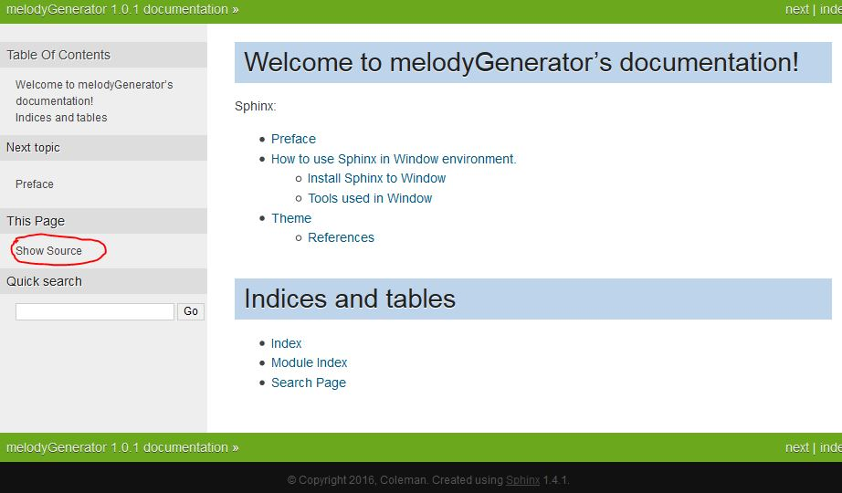

reStructuredText 
============================================
Primer on rst
-----------------------------------------------------
I have found good websites for learning rst. They are in the References session.
Please be aware that rst is white-space sensitive.

References
^^^^^^^^^^^^^^^^^^^^^^^^^^^^^^^^^^^^^^^^^^^^^^^^^^^^^^^^
#. `Quick reStructuredText <http://docutils.sourceforge.net/docs/user/rst/quickref.html>`_.

#. `reStructuredText Primer <http://www.sphinx-doc.org/en/stable/rest.html>`_.

Learn from other documentation website
-----------------------------------------------------
	In my opinion, I think the best way to learn rst to maintain this documentation is simply copying/learning the syntax from other documentation websites that are built by Sphinx.
	
	For the typical outlook of the documentation website, you can click the "Show Source" button in the page to see the rst source code for that page as shown in the following figure.
	

	You can find a tone of the documentation websites in the 1st reference.
	
I have learn most of the syntax from the following two websites.

	Welcome to LinearLeastSquares
	http://lls.readthedocs.org/
	
	EvaEngine Quick Start
	https://evaengine.readthedocs.io/en/latest/en/quickstart.html
	
I have also recorded some other documentation websites.

- Welcome to libreant’s documentation!
http://libreant.readthedocs.io/en/latest/

- Triton Documentation
http://triton.readthedocs.io/en/latest/

- Welcome to MinPy’s documentation!
http://minpy.readthedocs.io/en/latest/

- ERA Report Parser’s documentation
http://era-report-parser.readthedocs.io/en/latest/

- Documentation for fm
http://fm-dnf-plugin.readthedocs.io/en/latest/

- modulemd’s documentation
http://modulemd.readthedocs.io/en/latest/#

- Welcome to Read the Docs
http://nouveau.readthedocs.io/en/latest/

- Welcome to LinearLeastSquares
http://lls.readthedocs.io/en/latest/index.html

- amqpstorm package
http://amqpstorm.readthedocs.io/en/latest/
	

References
^^^^^^^^^^^^^^^^^^^^^^^^^^^^^^^^^^^^^^^^^^^^^^^^^^^^^^^^
#. `readthedocs <https://readthedocs.org/>`_.

