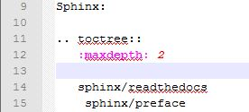

reStructuredText 
==================
As I have told you before, Sphinx reads the source code in rst to generate website document.
Hence, it is essential to learn rst. 
reStructuredText is the full name of rst.

It is very easy to learn rst. In my opinion, you do not need to go through the rst document first.
You can learn it by writing it.

However, I need to give you some advices first.
rst is white-space senestive. For the following figure, line 15 is not appended to the tree while line 14 is appended to the tree. It is because line 14 has the same depth of indentation as the ":maxdepth: 2". Hence, please be aware of space and tab.

Normally, the code is indented with 2 spaces while ``toctree`` directive requires a 3 spaces indentation.

- http://documentation-style-guide-sphinx.readthedocs.io/en/latest/style-guide.html

Besides, new line does not matter. You can write a sentence in several lines instead of one line. Only the **empty** new line matters. In other words, the following two scripts is the same in rst.

.. code-block:: html

	It is the same.
	

.. code-block:: html

	It
	is
	the
	same.

I think you (as a University student or even Postgraduate student) can learn it by yourself.
Hence, just start.

rst cheat sheet
-------------------
I have found good websites for learning rst. The 1st website is my favourite.

In addition, you can see the real-time effect of your input rst by the following website.

- http://socrates.io/

References
^^^^^^^^^^^
#. `Restructured Text (reST) and Sphinx CheatSheet <http://thomas-cokelaer.info/tutorials/sphinx/rest_syntax.html>`_.

#. `Quick reStructuredText <http://docutils.sourceforge.net/docs/user/rst/quickref.html>`_.

#. `reStructuredText Primer <http://www.sphinx-doc.org/en/stable/rest.html>`_.

Other documentation websites
-----------------------------
In my opinion, I think the best way to learn rst is simply copying/learning the syntax from other documentation websites that are built by Sphinx.

.. image:: ../images/showSource.JPG

For default outlook of sphinx document website, you can click the "Show Source" button in the page to see the rst source code for that page as shown in the above figure.

Or you can go the corresponding GitHub of that document to see the source code.

You can find many sphinx documentation website from the following website.

- readthedocs
https://readthedocs.org/
 
I start this website by learning the syntax from the following two websites.

- Welcome to LinearLeastSquares 
http://lls.readthedocs.org/
	
- EvaEngine Quick Start 
https://evaengine.readthedocs.io/en/latest/en/quickstart.html
	
References
^^^^^^^^^^^^

The following are some websites that I found in the mainpage of readthedocs when I wrote this page.

- Welcome to libreant’s documentation!
http://libreant.readthedocs.io/en/latest/

- Triton Documentation
http://triton.readthedocs.io/en/latest/

- Welcome to MinPy’s documentation!
http://minpy.readthedocs.io/en/latest/

- ERA Report Parser’s documentation
http://era-report-parser.readthedocs.io/en/latest/

- Documentation for fm
http://fm-dnf-plugin.readthedocs.io/en/latest/

- modulemd’s documentation
http://modulemd.readthedocs.io/en/latest/#

- Welcome to Read the Docs
http://nouveau.readthedocs.io/en/latest/

- Welcome to LinearLeastSquares
http://lls.readthedocs.io/en/latest/index.html

- amqpstorm package
http://amqpstorm.readthedocs.io/en/latest/
