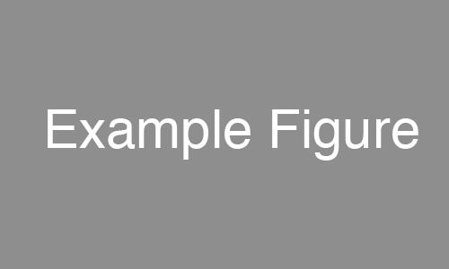

*******************
Template
*******************
Please read the rst and html together to learn rst.

**How to use hierarchical properly.**

We only use about 2 levels in a webpage.

Title for section
======================

Title for subsection
----------------------

Title for subsubsection
^^^^^^^^^^^^^^^^^^^^^^^^

Title of paragraph
""""""""""""""""""""

.. _basicExamples-label:

Basic examples
===============
**How to use different inline markup.**

*text* for emphasis (italics),

**text** for strong emphasis (boldface), and

``text`` for code samples.

**How to tidy up sentences properly.**

Sentence1. 
Sentence2.

Sentence3.

| Sentence4.
| Sentence5.
|
|
|
Sentence6.

References
-----------
http://rest-sphinx-memo.readthedocs.io/en/latest/ReST.html#line-blocks

**How to use indentation.**

Hello, I am Coleman.

	Hello, I am Coleman.
	
		Hello, I am Coleman.

**How to block comment.**

Use cannot see the block commented content in html.

..
   This whole indented block
   is a comment.

   Still in the comment.
   
**How to insert an image.**

**How to use code block to display code.**

.. code-block:: html

	<html>
	<head>
	<meta name="GENERATOR" content="Microsoft FrontPage 6.0">
	<meta name="ProgId" content="FrontPage.Editor.Document">
	<meta http-equiv="Content-Type" content="text/html; charset=big5">
	<title>Coleman's Progress</title>
	</head>

**How to use tables.**

The first table

+------------------------+------------+----------+----------+
| Header row, column 1   | Header 2   | Header 3 | Header 4 |
| (header rows optional) |            |          |          |
+========================+============+==========+==========+
| body row 1, column 1   | column 2   | column 3 | column 4 |
+------------------------+------------+----------+----------+
| body row 2             | ...        | ...      |          |
+------------------------+------------+----------+----------+

The second table

=====  =====  =======
A      B      A and B
=====  =====  =======
False  False  False
True   False  False
False  True   False
True   True   True
=====  =====  =======

**How to link to a internal file.**

:download:`A link<../files/someFile.pdf>`

**How to insert dialogs.**

.. warning:: I am a lovely warning dialog.

**How to insert external links.**

This is a paragraph that contains `a link`_.

.. _a link: http://example.com/

`A link <http://example.com/>`_.

Go to arbitrary locations in any document, see :ref:`basicExamples-label`.

This works just as well when section and reference are in different source files, see :ref:`tMusic-related-label`.

A more direct way :doc:`../tMusic/related`

References
-----------
http://www.sphinx-doc.org/en/stable/markup/inline.html#cross-referencing-arbitrary-locations

**How to use lists and nested lists.**

- This is a bulleted list.
- It has two items, the second
  item uses two lines.

* This is a bulleted list.
* It has two items, the second
  item uses two lines.

1. This is a numbered list.
2. It has two items too.

#. This is a numbered list.
#. It has two items too.

* this is
* a list

  * with a nested list
  * and some subitems

* and here the parent list continues

Maths mode
============
html does support maths equation in text form, Sphinx generates the maths equation in png format.
We can type maths equeation just like in Latex.

In other to use Math mode, you need to add the extension to the "config.py".
Don't be worry. I have already added this extension.

:math:`\alpha > \beta`

.. math::

    n_{\mathrm{offset}} = \sum_{k=0}^{N-1} s_k n_k
	
References
-----------
http://thomas-cokelaer.info/tutorials/sphinx/rest_syntax.html#pngmath-maths-and-equations-with-latex

Insert a Video
==================

.. raw:: html
	
    <iframe width="560" height="315" src="https://www.youtube.com/embed/DZ4VE5X0MPs?list=PLjt53hoA-8cvA3r0QiRvF3xOZT5W6TdXy" frameborder="0" allowfullscreen></iframe>

References
-----------
https://groups.google.com/forum/#!topic/sphinx-users/_z00m3zoRAY

Insert an Audio
==================

:download:`A link<../files/someAudio.mp3>`

.. raw:: html

    <audio controls>
    <source src="../_downloads/someAudio.mp3" type="audio/mpeg">
    Your browser does not support the audio element.
    </audio> 
	
We use the download directive to copy the audio file from source folder to built folder.
Then embed the audio by html.
 
References
-----------
http://www.w3schools.com/html/html5_audio.asp

